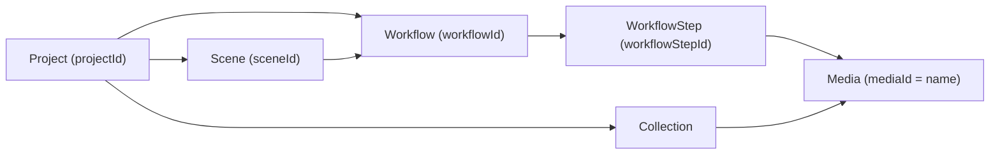

# 1. Tổng quan kiến trúc

## 1.1 Hai host, hai lớp API

Flow chạy trên hai bề mặt API riêng biệt. Phân biệt được hai cái này là điều quan
trọng nhất khi tích hợp, vì cách xác thực và định dạng payload khác nhau.

| Lớp | Host | Auth | Định dạng |
|-----|------|------|-----------|
| Backend AI | `https://aisandbox-pa.googleapis.com` | `Authorization: Bearer ya29...` | JSON kiểu protobuf (camelCase, enum `SCREAMING_SNAKE`) |
| BFF của frontend | `https://labs.google/fx/api` | Cookie session của `labs.google` | tRPC (bọc ngoài `{"json": {...}}`) |

Lớp tRPC chỉ là một lớp mỏng: nó giữ session, tạo/xoá project, và proxy một phần
config. Mọi việc sinh media thật đều đi trực tiếp từ browser đến
`aisandbox-pa.googleapis.com` bằng bearer token.

## 1.2 Định danh service

- Service proto: `google.internal.labs.aisandbox.proto.videofx.v1.VideoFxService`
- Tên tool nội bộ dùng trong `clientContext.tool`: `PINHOLE`
- URL frontend: `https://labs.google/fx/vi/tools/flow/project/<projectId>`
- Scene editor: `https://labs.google/fx/vi/tools/flow/project/<projectId>/edit/<sceneId>`

`PINHOLE` xuất hiện trong hầu hết request tới backend (`clientContext.tool`) và
trong telemetry (`TOOL_NAME`). Các chuỗi nội bộ khác trong bundle cũng dùng tiền tố
`pinhole/` (ví dụ `pinhole/setMainVideoUrl`, `pinhole/clearThePromptBox`).

## 1.3 Mô hình dữ liệu

Bốn thực thể chính, quan hệ lồng nhau:



- **Project** — không gian làm việc. Tạo qua tRPC `project.createProject`.
- **Workflow** — một lần sinh media (batch). Mỗi request batch tạo ra 1..n workflow.
- **Media** — một output cụ thể. Trường `name` của media chính là `mediaId` (UUID).
- **Scene** — nhóm workflow theo trình tự để dựng video dài.
- **Collection** — thư mục để sắp xếp media.

Điểm dễ nhầm: trong response, media được định danh bằng `name` (UUID), không phải
`mediaId`. Riêng response của ảnh có cả `name` và `image.generatedImage.mediaId`
(cùng giá trị) cộng với `mediaGenerationId` (chuỗi dài ~162 ký tự, khác UUID).

## 1.4 Mô hình sinh media: đồng bộ vs không đồng bộ

| Loại | Endpoint | Hành vi |
|------|----------|---------|
| Ảnh | `flowMedia:batchGenerateImages` | **Đồng bộ**. Response trả ngay `fifeUrl` + kích thước thật. |
| Video | `video:batchAsyncGenerateVideo*` | **Không đồng bộ**. Response trả media với `mediaGenerationStatus` đang chờ, phải poll. |

Đó là lý do có endpoint poll riêng: `video:batchCheckAsyncVideoGenerationStatus`.

## 1.5 Hai đường tạo video

Flow cho hai đường khác nhau, và tài liệu cũ từng kết luận sai rằng chỉ có đường agent.

1. **Đường trực tiếp (direct API)** — gọi thẳng
   `POST /v1/video:batchAsyncGenerateVideoText` với `videoModelKey`, `aspectRatio`,
   `seed`, prompt. Đây là đường mà UI dùng khi agent mode TẮT. Không có agent trung
   gian, không có bước "phê duyệt".
2. **Đường agent** — `POST /v1/flowCreationAgent/...` (SSE). Agent tự chọn model,
   số lượng, aspect ratio rồi hỏi xác nhận credit. Mặc định agent tạo 4 video/lần.

Cho tự động hoá, đường trực tiếp đơn giản và rẻ hơn: kiểm soát được đúng 1 video và
đúng model mình chọn. Cả hai đường đều cần `recaptchaContext.token`.

## 1.6 Rào cản duy nhất còn lại: reCAPTCHA

Mọi request sinh media (ảnh và video) đều mang `clientContext.recaptchaContext`:

```json
{ "token": "<~2300-2400 ký tự>", "applicationType": "RECAPTCHA_APPLICATION_TYPE_WEB" }
```

Token này sinh ra trong trang bằng reCAPTCHA Enterprise, đổi mới mỗi lần gọi. Không
thể tái sử dụng ngoài trang. Cách thực tế để lấy: chạy JS trong page context
(CDP/Playwright) để lấy token rồi gọi API từ đấy, hoặc để trang tự gọi.
Xem [02-auth.md](02-auth.md) mục 2.4 và [10-ui-automation.md](10-ui-automation.md).

Các endpoint đọc (credits, appConfig, models/statuses, userSettings, danh sách
applet, poll trạng thái video) KHÔNG cần reCAPTCHA — chỉ cần bearer token.

## 1.7 Quy ước trong tài liệu

- `<projectId>`, `<mediaId>`, `<workflowId>`, `<sceneId>` — UUID v4.
- Kiểu dữ liệu được ghi dạng `str`, `int`, `bool`, `str<uuid>`, `str<url>`.
- Khi một chuỗi là enum, tài liệu trỏ tới [07-enums.md](07-enums.md) thay vì đoán.
- Độ dài chuỗi ghi dạng `len=N` là độ dài quan sát được trong mẫu thật, không phải
  giới hạn của API.
