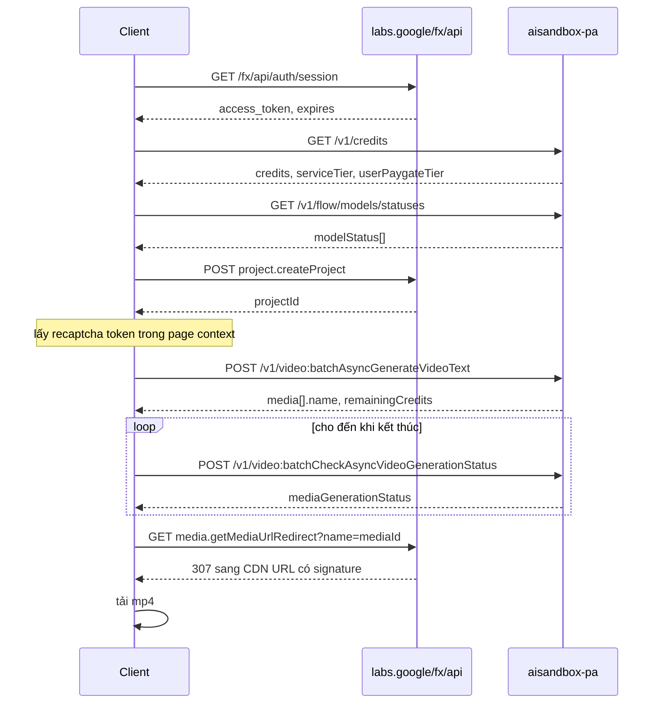

# 5. Luồng sinh media

## 5.1 Luồng text-to-video (đường trực tiếp)



Các bước bắt buộc, theo đúng thứ tự:

1. Lấy `access_token` từ `GET /fx/api/auth/session`.
2. Đọc `serviceTier` và `userPaygateTier` từ `GET /v1/credits`. Hai giá trị này quyết
   định model nào dùng được và giá bao nhiêu.
3. Chọn `videoModelKey` hợp lệ với tier **và** aspect ratio muốn dùng.
4. Sinh `batchId` (UUID v4) ở phía client.
5. Lấy `recaptchaContext.token` mới.
6. `POST /v1/video:batchAsyncGenerateVideoText` với đúng số phần tử `requests[]` bằng
   số video muốn có.
7. Lưu `media[].name` + `media[].projectId`, đọc `remainingCredits` để biết chi phí.
8. Poll `video:batchCheckAsyncVideoGenerationStatus` cho đến khi trạng thái kết thúc.
9. Lấy URL tải qua `media.getMediaUrlRedirect`.

## 5.2 Chọn model đúng: quy tắc ràng buộc

Ba ràng buộc dễ sai:

**Ràng buộc tier.** `creditMapping` có thể là `"UNAVAILABLE"` cho tier của bạn. Ví dụ
`veo_3_1_t2v_fast_ultra` chỉ có ở `SERVICE_TIER_ADVANCED`; ở `INTERMEDIATE`/`ENTRY`
nó là `UNAVAILABLE`.

**Ràng buộc hướng.** Nhiều usage key khoá cứng một aspect ratio:

| Usage key | Aspect ratio cho phép |
|-----------|----------------------|
| `veo_3_1_t2v_fast` | chỉ `LANDSCAPE` |
| `veo_3_1_t2v_fast_portrait` | chỉ `PORTRAIT` |
| `veo_3_1_t2v_fast_4s` | cả `LANDSCAPE` và `PORTRAIT` |
| `abra_t2v_*` | cả hai |
| `veo_3_1_*_lite` | cả hai |

**Ràng buộc độ dài.** Độ dài video không phải tham số tự do — nó nằm trong tên model.
`veo_3_1_t2v_fast` = 8 giây, `veo_3_1_t2v_fast_4s` = 4 giây, `veo_3_1_t2v_fast_6s` =
6 giây. Muốn đổi độ dài thì đổi usage key, không phải truyền một trường `duration`.

## 5.3 Các chế độ sinh video và yêu cầu input

`requirements` trong `modelConfig` liệt kê các tổ hợp input hợp lệ. Các tổ hợp quan
sát được:

| Chế độ | requirements | Endpoint |
|--------|--------------|----------|
| Text-to-video | `[TEXT]` | `...VideoText` |
| Image-to-video | `[TEXT, START_IMAGE]` | `...VideoStartImage` |
| Nội suy đầu-cuối | `[TEXT, START_IMAGE, END_IMAGE]` | `...VideoStartAndEndImage` |
| Reference-to-video | `[TEXT, REFERENCES]`, có thể thêm `AUDIO_REFERENCE`, `CHARACTERS` | `...VideoReferenceImages` |
| Kéo dài video | `[TEXT, EXTENSION]` | `...VideoExtendVideo` |
| Sửa video | `[TEXT, REFERENCES, AUDIO_REFERENCE, CHARACTERS, VIDEO_EDIT]` | `...VideoEditVideo` |
| Upsample 1080p | `[UPSAMPLE1080]` | `...VideoUpsampleVideo` |
| Upsample 4K | `[UPSAMPLE4K]` | `...VideoUpsampleVideo` |

Tiền tố đầy đủ là `VIDEO_REQUIREMENT_*` (ví dụ `VIDEO_REQUIREMENT_START_IMAGE`).
Với ảnh, tiền tố là `IMAGE_REQUIREMENT_*`: `TEXT`, `BASE_IMAGE`, `REFERENCES`,
`CHARACTERS`.

Giới hạn input kèm theo, đọc từ `inputSpec`:

| Model | maxCharacters | maxAudioReferences | maxInputV2vVideoDuration |
|-------|---------------|--------------------|--------------------------|
| `GEM_PIX_2` (ảnh) | 10 | — | — |
| `abra_r2v_*` | 3 | 5 | — |
| `abra_edit` | 3 | 3 | 10 giây |
| `veo_3_1_r2v_lite` | 3 | 1 | — |
| `veo_3_1_extension_lite` | — | — | 8 giây |

## 5.4 Luồng sinh ảnh

Đơn giản hơn vì đồng bộ:

1. Lấy token + recaptcha.
2. `POST /v1/projects/<projectId>/flowMedia:batchGenerateImages`.
3. Đọc `media[].image.generatedImage.fifeUrl` — dùng được ngay.

Không cần poll, không cần redirect. Theo bảng giá, chi phí 0 credit ở mọi tier.

## 5.5 Ví dụ: sinh 1 video 8 giây, đọc 20 credit

Đoạn dưới chạy từ **page context** (có sẵn cookie và lấy được recaptcha). Nếu chạy từ
server, thay phần lấy token/recaptcha bằng giá trị đã lấy sẵn.

```javascript
// Chạy trong page context của https://labs.google/fx/vi/tools/flow/project/<id>
async function genOneVideo({ projectId, prompt, modelKey, aspect }) {
  const { access_token } = await (
    await fetch("/fx/api/auth/session", { credentials: "include" })
  ).json();

  // Token reCAPTCHA phải lấy từ runtime của trang; mỗi lần gọi một token mới.
  const recaptchaToken = await window.__getFlowRecaptchaToken();

  const body = {
    mediaGenerationContext: {
      batchId: crypto.randomUUID(),
      audioFailurePreference: "AUDIO_FAILURE_PREFERENCE_UNSPECIFIED",
    },
    clientContext: {
      projectId,
      tool: "PINHOLE",
      userPaygateTier: "PAYGATE_TIER_ONE",
      sessionId: String(Date.now()),
      recaptchaContext: {
        token: recaptchaToken,
        applicationType: "RECAPTCHA_APPLICATION_TYPE_WEB",
      },
    },
    // Đúng 1 phần tử = đúng 1 video = đúng 1 lần tính phí.
    requests: [
      {
        aspectRatio: aspect,                       // VIDEO_ASPECT_RATIO_LANDSCAPE | _PORTRAIT
        textInput: { structuredPrompt: { parts: [{ text: prompt }] } },
        videoModelKey: modelKey,                   // vd veo_3_1_t2v_fast
        seed: Math.floor(Math.random() * 2 ** 31),
        metadata: {},
      },
    ],
    useV2ModelConfig: true,
  };

  const res = await fetch(
    "https://aisandbox-pa.googleapis.com/v1/video:batchAsyncGenerateVideoText",
    {
      method: "POST",
      headers: {
        Authorization: `Bearer ${access_token}`,
        "Content-Type": "application/json",
      },
      body: JSON.stringify(body),
    }
  );
  if (!res.ok) throw new Error(`generate failed: ${res.status}`);
  const data = await res.json();
  return {
    mediaId: data.media[0].name,
    projectId: data.media[0].projectId,
    remainingCredits: data.remainingCredits,
  };
}
```

Poll cho đến khi xong:

```javascript
const TERMINAL = new Set([
  "MEDIA_GENERATION_STATUS_SUCCESSFUL",
  "MEDIA_GENERATION_STATUS_COMPLETE",
  "MEDIA_GENERATION_STATUS_FAILED",
  "MEDIA_GENERATION_STATUS_CANCELED",
]);

async function waitForVideo({ accessToken, mediaId, projectId, timeoutMs = 600000 }) {
  const deadline = Date.now() + timeoutMs;
  while (Date.now() < deadline) {
    const res = await fetch(
      "https://aisandbox-pa.googleapis.com/v1/video:batchCheckAsyncVideoGenerationStatus",
      {
        method: "POST",
        headers: {
          Authorization: `Bearer ${accessToken}`,
          "Content-Type": "application/json",
        },
        body: JSON.stringify({ media: [{ name: mediaId, projectId }] }),
      }
    );
    const m = (await res.json()).media?.[0];
    const status = m?.mediaMetadata?.mediaStatus?.mediaGenerationStatus;
    if (TERMINAL.has(status)) return { status, media: m };
    await new Promise((r) => setTimeout(r, 8000));
  }
  throw new Error("timeout chờ video");
}
```

Tải file:

```javascript
async function downloadVideo(mediaId) {
  const url = `/fx/api/trpc/media.getMediaUrlRedirect?name=${mediaId}`;
  const res = await fetch(url, { credentials: "include", redirect: "follow" });
  if (!res.ok) throw new Error(`download failed: ${res.status}`);
  return await res.blob(); // video/mp4
}
```

## 5.6 Kiểm soát chi phí

Bốn nguyên tắc rút ra từ đo thật:

1. **Số video bằng số phần tử `requests[]`.** Không có trường "số lượng" riêng.
2. **`remainingCredits` trong response là nguồn đáng tin nhất.** Không cần gọi lại
   `/v1/credits` để tính chi phí.
3. **Sinh thất bại không trừ credit.** Đã xác nhận: 4 video lỗi, credit không đổi.
4. **Đường agent đắt hơn đường trực tiếp** vì mặc định sinh 4 video. Nếu buộc phải
   dùng agent, viết rõ trong prompt rằng chỉ tạo 1 video.

## 5.7 Độ dài chờ đợi thực tế

`generationTimeSeconds` từ `modelConfig` (ước lượng của hệ thống, không phải cam kết):

| Nhóm model | Thời gian ước tính |
|------------|--------------------|
| `veo_3_1_*_fast` (t2v) | 100 giây |
| `veo_3_1_*_lite` | 110 giây |
| `abra_*` (Omni Flash) | 120 giây |
| `veo_3_1_*_quality` | 120 giây |
| `veo_3_1_i2v_s_fast` | 180 giây |
| `abra_edit` | 160 giây |
| `veo_3_1_extend_*` | 270-330 giây |
| Upsample 1080p / 4K | 330 giây |

Đặt timeout ít nhất gấp đôi các số này, và tính thêm trường hợp
`PUBLIC_ERROR_HIGH_TRAFFIC` làm chậm hơn bình thường.
