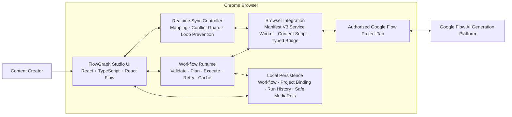

# FlowGraph Extension

<p align="center">
  <strong>Visual node-based workflow orchestration for Google Flow</strong>
</p>

<p align="center">
  
  
  
  
  
</p>

> **Status:** FlowGraph Real Runtime V1 is ready for demonstration and Capstone evaluation. The core Google Flow pipeline has been verified repeatedly with real generated media, exact upstream media binding, real previews, and real MP4 downloads.

## Overview

**FlowGraph Extension** is a Chrome Extension that turns Google Flow media creation into a reusable visual workflow system.

Instead of manually repeating steps such as entering prompts, generating images, finding intermediate media, switching generation modes, and downloading results, users build a graph of connected nodes. FlowGraph validates the graph, resolves dependencies, passes exact media references between nodes, executes supported operations against the authorized Google Flow project, tracks runtime state, and exposes the resulting media back in the Studio.

FlowGraph does **not** replace Google Flow and does not train its own image or video model. Google Flow remains the external AI generation platform; FlowGraph provides the workflow editor, orchestration runtime, project isolation, browser integration, synchronization, persistence, and reliability layer around it.

## Why FlowGraph?

Multi-step AI media production becomes difficult to reproduce when every operation is performed manually. FlowGraph addresses this by providing:

- a visual node editor with typed inputs and outputs;
- reusable workflows instead of repeated manual setup;
- exact media passing between dependent nodes;
- project-aware execution and fail-closed project isolation;
- graph validation before any provider operation is started;
- asynchronous generation tracking and normalized runtime errors;
- project-scoped cache, retry, run history, and workflow persistence;
- realtime synchronization for supported Google Flow UI counterparts;
- real media preview and Chrome-based downloads.

## Verified V1 Pipeline

The primary V1 end-to-end workflow is:

```text
Prompt
  ↓
Text-to-Image
  ↓ exact IMAGE MediaRef
Image-to-Video
  ↓ exact VIDEO MediaRef
Download
```

Three clean cache-bypassed full-chain verification runs were completed on the same live test project. Every pass produced a new image, a new video, and a real MP4 artifact.

| Verification | Result |
|---|---:|
| Automated tests | **1156 / 1156 PASS** |
| Test files | **87 / 87 PASS** |
| TypeScript | **0 errors** |
| Production build | **PASS** |
| Clean full-chain E2E runs | **3 / 3 PASS** |
| Exact Text-to-Image → Image-to-Video binding | **PASS** |
| Real image preview | **PASS** |
| Real video generation | **PASS** |
| Real MP4 download | **PASS** |
| Project Gate | **PASS** |
| Secret/evidence scan | **PASS** |

A separate Text-to-Video executor is also runtime verified through multiple live Google Flow runs.

## Core Features

### Visual Workflow Studio

- Drag-and-drop node canvas powered by React Flow.
- Typed node ports such as `PROMPT`, `IMAGE`, `VIDEO`, `MEDIA`, `BOOLEAN`, and `FILE`.
- Node configuration through the Studio inspector.
- Real node lifecycle and media preview state.
- Save, reload, and restore workflow definitions and safe runtime references.

### Project Gate

FlowGraph is project-scoped by design. The canvas and Run action remain locked until the extension can verify:

```text
Google Account CONNECTED
        +
Google Flow READY
        +
Active Google Flow Project
        ↓
UNLOCK CANVAS
```

If the active Flow project disappears or the user navigates away from a project, the gate returns to a locked state instead of continuing with stale media or project state.

### Workflow Runtime

The runtime is responsible for:

- graph validation;
- cycle detection;
- dependency planning / topological execution;
- bounded concurrency;
- typed runtime values;
- exact upstream media resolution;
- polling for asynchronous generation;
- normalized error handling;
- retry and downstream resume;
- project-scoped caching;
- run history and safe result persistence;
- cancellation/abort behavior where supported.

Unsupported node kinds are rejected before a provider call. FlowGraph does not simulate runtime success for nodes without an enabled executor.

### Realtime Google Flow Synchronization

For Google Flow controls that have a real UI counterpart, FlowGraph includes a synchronization layer for supported fields such as:

- active generation node / mode;
- prompt;
- model;
- aspect ratio;
- duration;
- resolution;
- Start Frame / End Frame bindings;
- ordered Reference Media;
- project state;
- generation lifecycle and result state.

The synchronization subsystem includes sequence/conflict handling, loop prevention, and project-mismatch protection.

## Runtime Capability Status

The table below describes the **execution runtime**, not merely whether a node is visible in the UI.

| Node / Capability | Runtime status | Notes |
|---|---|---|
| Prompt | `RUNTIME_VERIFIED` | Local typed prompt output |
| Text-to-Image | `RUNTIME_VERIFIED` | Real Google Flow UI generation |
| Text-to-Video | `RUNTIME_VERIFIED` | Real Google Flow video generation |
| Image-to-Video | `RUNTIME_VERIFIED` | Exact upstream image media binding |
| Download | `RUNTIME_VERIFIED` | Real media resolution + Chrome Downloads |
| Start Frame / End Frame Interpolation | `RUNTIME_PARTIAL` | Adapter/sync support exists; standalone executor pending |
| Reference Images Video | `RUNTIME_PARTIAL` | Adapter/sync support exists; standalone executor pending |
| Extend / Edit Video | `RUNTIME_PARTIAL` | Adapter contract exists; executor pending |
| Video Upscale | `RUNTIME_PARTIAL` | Provider path not fully runtime verified |
| Image Transform | `RUNTIME_PARTIAL` | Provider path partially verified |
| Image Upscale | `RUNTIME_PARTIAL` | Payload/enums known; runtime constrained by provider behavior |
| Cancel Generation | `RUNTIME_PARTIAL` | Runtime/adapter support is not fully live verified |
| Upload Image | `UI_ONLY` | Adapter exists; V1 node executor is not enabled |
| Gemini Enhance | `UI_ONLY` | UI/integration surface; not a V1 verified executor |
| Character / Likeness nodes | `UI_ONLY` / `RUNTIME_PARTIAL` | Outside the stable V1 execution path |
| Condition / Delay / Note | `UI_ONLY` | Local/advanced workflow layer |

For the source-of-truth matrix, see the project capability documentation and `src/ui/studio/capabilities.ts`.

## Architecture



### Main architectural layers

| Layer | Responsibility |
|---|---|
| Studio UI | Node palette, canvas, inspector, project gate, preview, run controls |
| Workflow Runtime | Validation, graph planning, executors, cache, retry, polling, execution state |
| Realtime Sync | Active-node mapping, field synchronization, conflict/echo protection |
| Google Flow Adapter | Normalized project/media/generation operations |
| Service Worker | Chrome extension background orchestration and browser APIs |
| Content Script | Observes and communicates with the authorized Google Flow project UI |
| Local Persistence | Workflow state, project binding, safe media references, run history |

## Technology Stack

| Area | Technology |
|---|---|
| Frontend | React 18.3.1 |
| Language | TypeScript 5.9.3 (resolved by the current lockfile) |
| Node canvas | `@xyflow/react` 12.8.x |
| Extension platform | Chrome Extension Manifest V3 |
| Build tooling | Vite 6.x |
| Testing | Vitest 2.x |
| Browser integration | Chrome Side Panel, Identity, Scripting, Downloads, Debugger APIs |
| Provider | Google Flow |
| Persistence | Browser-local application state; no standalone DBMS in V1 |

There is no standalone application backend required for the core V1 product. Runtime background behavior executes inside the Manifest V3 extension service worker.

## Installation for Development

### Requirements

- Desktop Google Chrome / Chromium.
- Node.js and npm.
- A Google account with access to Google Flow.
- A Google Flow project selected or created before running a workflow.

### 1. Clone and install

```bash
git clone https://github.com/Thangterter-Pipo/flowgraph-extension.git
cd flowgraph-extension
npm ci
```

### 2. Build the extension

```bash
npm run build
```

The production extension is generated in:

```text
dist/
```

### 3. Load in Chrome

1. Open `chrome://extensions`.
2. Enable **Developer mode**.
3. Choose **Load unpacked**.
4. Select the repository's `dist/` directory.
5. Open Google Flow and sign in normally.
6. Open or create a Google Flow project.
7. Open FlowGraph Extension and wait for the Project Gate to report a valid active project.

Google login remains a normal manual user step. The project does not automate passwords, cookies, or authentication challenges.

## Development Commands

```bash
# Development UI
npm run dev

# TypeScript check
npm run typecheck

# Automated tests
npm test

# Production build
npm run build
```

Current V1 verification baseline:

```text
Tests:       104 / 104 PASS
TypeScript:  0 errors
Build:       PASS
```

## Security and Trust Boundaries

FlowGraph follows a fail-closed integration policy:

- no CAPTCHA or reCAPTCHA bypass;
- no synthetic security-token generation;
- no Google password storage;
- no raw cookie export to the React UI;
- no bearer/access token stored as workflow data;
- no reCAPTCHA token persisted to local storage or workflow JSON;
- no fake media result when Google Flow does not produce a verifiable result;
- no cross-project media reuse when project identity does not match;
- provider/security challenges surface as explicit errors such as `CAPTCHA_REQUIRED`.

The extension uses the user's authorized Google Flow browser session and normal browser capabilities to operate the workflow. Security challenges that require the user are left to the user.

## Reliability Rules

FlowGraph intentionally prefers a visible failure over an unverifiable success.

Examples:

- If an upstream image cannot be matched exactly, Image-to-Video fails instead of selecting a nearby or latest image.
- If a returned video cannot be attributed to the current node, the runtime does not claim it as success.
- If a project changes, project-bound runtime state is invalidated instead of reused silently.
- If an advanced capability is not fully verified, its status remains `RUNTIME_PARTIAL` or `UI_ONLY`.

## V1 Engineering Notes

Several real-world Google Flow integration issues were identified and fixed during live verification, including:

- restoring the project gallery after media resolution/download;
- polling Chrome download state rather than relying on incomplete event deltas;
- propagating sync state after composer changes;
- separating worker generation budgets from the outer extension bridge timeout;
- handling lazy/signed video poster URLs;
- detecting video completion in a virtualized Google Flow gallery where a new clip may replace an old tile instead of increasing the tile count.

These fixes are covered by regression tests where the decision logic can be isolated from the live provider UI.

## Known V1 Limitations

The following items do **not** block the V1 release gate but remain follow-up work:

- first-time cold-session Google login is manual;
- reliable live provider credit delta is not available from the current UI integration;
- retry/cancel are covered by automated tests but have not been re-exercised as dedicated live release cases;
- some diagnostic scaffolding can be simplified in a later cleanup pass;
- visual updates can be less smooth when the Google Flow tab is heavily backgrounded;
- advanced Full Nodes such as Interpolation, Reference Video, Extend, and Upscale still need complete standalone runtime executors/live verification.

## Repository Structure

```text
flowgraph-extension/
├─ src/
│  ├─ adapters/google-flow/   # normalized provider adapter
│  ├─ background/             # Manifest V3 service worker logic
│  ├─ content/                # Google Flow content integration
│  ├─ engine/                 # execution interfaces
│  ├─ runtime/                # graph runtime, executors, cache, polling
│  ├─ shared/                 # typed bridge, sync contracts, shared types
│  └─ ui/                     # Side Panel + FlowGraph Studio
├─ tests/unit/                # automated regression/unit tests
├─ evidence/                  # sanitized verification evidence
├─ docs/                      # proposal, architecture and technical documentation
├─ public/                    # extension static assets, content script & shipped manifest
├─ package.json
└─ README.md
```

## Documentation

Useful project documents include:

- `docs/FLOWGRAPH_EXTENSION_PROPOSAL.md`
- `docs/FLOWGRAPH_EXTENSION_ARCHITECTURE_DRIVER.md`
- `docs/PROJECT_STRUCTURE.md`
## 8. Trạng thái Runtime & Live Verification Matrix (V1 Milestone)

| Node Kind | Runtime Status | Executor | Adapter | Verification Evidence |
| :--- | :---: | :---: | :---: | :--- |
| `t2i` (Text to Image) | ✅ **RUNTIME_VERIFIED** | Yes | Yes | Live runs on Flow, fifeUrl extraction, realtime sync. |
| `t2v` (Text to Video) | ✅ **RUNTIME_VERIFIED** | Yes | Yes | Flow UI VIDEO mode + Veo generation verified. |
| `i2v` (Image to Video) | ✅ **RUNTIME_VERIFIED** | Yes | Yes | Start image binding + Veo Omni generation verified. |
| `interpolation` (Start-End) | ✅ **RUNTIME_VERIFIED** | Yes | Yes | Dual-frame binding + Veo interpolation verified. |
| `reference` (Reference Video) | ✅ **RUNTIME_VERIFIED** | Yes | Yes | Multi-image & Character reference video verified. |
| `extend` (Extend Video) | ✅ **RUNTIME_VERIFIED** | Yes | Yes | Video clip extension verified live. |
| `imageUpscale` (2K/4K) | 🟡 **RUNTIME_PARTIAL** | Yes | Yes | Flow upscale wired; live security boundary (reCAPTCHA). |
| `videoUpscale` (1080p) | 🟡 **RUNTIME_PARTIAL** | Yes | Yes | Flow video upscale wired; live security boundary (reCAPTCHA). |
| `gemini` (AI Enhance) | ✅ **RUNTIME_VERIFIED** | Yes | Yes | Gateway proxy local :20128 (`cx/gpt-5.6-luna`) verified. |
| `characterCreate` (DNA) | 🟡 **RUNTIME_LOCAL** | Yes | No | Local 3-tier Character DNA lock (Local abstraction). |
| `uploadImage` | ✅ **RUNTIME_VERIFIED** | Yes | Yes | Local file upload to Flow verified. |
| `preview` / `download` | ✅ **RUNTIME_VERIFIED** | Yes | Yes | Pure fail-closed preview + master export verified. |

Some repository-level release/capability reports may also be maintained alongside the extension during Capstone development.

## Roadmap

### V1 — Real Runtime Core

- [x] Project Gate
- [x] Typed visual workflow editor
- [x] Graph validation and execution planning
- [x] Text-to-Image real runtime
- [x] Text-to-Video real runtime
- [x] Image-to-Video exact-media runtime
- [x] Real media preview
- [x] Real download
- [x] Workflow save / reload / restore
- [x] Cache / retry runtime
- [x] Realtime synchronization core
- [x] 104/104 automated tests
- [x] Repeated live E2E verification

### Next — Extended Full Node Coverage

- [ ] Start Frame / End Frame Interpolation executor
- [ ] Reference Images Video executor
- [ ] Extend / Edit Video executor
- [ ] Image / Video Upscale runtime completion
- [ ] Utility media input / preview nodes

### Later — Advanced Workflow Engine

- [ ] Variables / constants
- [ ] Switch / condition execution
- [ ] Batch generation
- [ ] Guarded loops
- [ ] Subflows
- [ ] Reusable workflow components
- [ ] Workflow templates and import/export

## Project Status

**FlowGraph Real Runtime V1: READY**

The V1 release gate is based on real Google Flow runs and real media artifacts, not simulated success.

---

### Disclaimer

FlowGraph Extension is an independent software-engineering project and is not an official Google product. Google Flow, Chrome, Gemini, and related product names are trademarks of their respective owners. Provider UI and behavior may change independently of this project.
